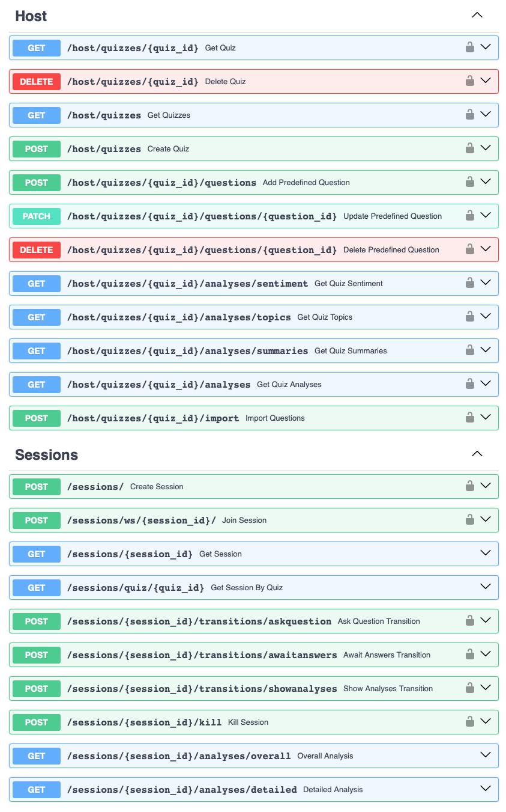

# Backend

The Quizzma backend comprises the backend API, database, and NLP processing module.

It is written in Python and uses Uv for project management. Docstrings and typing are consistently applied, and most of the code has asynchronous support using asyncio.

Use the links to jump to the different sections:
> - [Project management](#backend-management)
> - [Setup and run](#backend-setup)
> - [Backend API](#backend-api)
> - [Database migrations](#backend-database)
> - [Processing module](#backend-processing)

<a id="backend-management"></a>
### 📦 Uv - project management tool
Uv must be installed to run this project. See [https://docs.astral.sh/uv/getting-started/installation/](https://docs.astral.sh/uv/getting-started/installation/)

`pyproject.toml` configures the uv project, much like the `package.json` for node. Uv makes sure to set up a virtual environment automatically. To run a command in the venv use `uv run <command>`.

A few useful commands:

- `uv sync`: Sync venv and lockfile to `pyproject.toml`. `uv run <command>` runs `uv sync` under the hood.
- `uv add <dependency>`: Add and install a new dependency. It uses the packages from Pypi by default.
- `uv add --dev <dependency>`: Add and install a development dependency.
- `uv run task <task name>`: Uses taskipy to run commands defined under `[tool.taskipy.tasks]` in `pyproject.toml`.
- `uv tree`: Displays a tree showing all project dependencies and their relation.

<a id="backend-setup"></a>
### 🏗️ Setup and run
1. The backend communicates with Firebase to authenticate requests. Make sure to include a service account key at `./quizzmaFirebaseServiceAccountKey.json`.

2. To set up required secrets and environment variables, copy `.env.example`, name the copy `.env`, and set the variables according to the descriptions in the file.

3. Taskipy tasks are set up in `pyproject.toml` to run the backend and migrate database.
```bash
# 1. Navigate to this directory
cd backend

# 2. Prepare database and perform migration
uv run task migrate

# 3. Run backend application

# ⚠️ If your're using Windows, replace `export` to `set` under [tool.taskipy.tasks].

# Production using main NLP algorithms
uv run task prod
# Development using main NLP algorithms
uv run task dev-bert
# Development using baseline NLP algorithms
uv run task dev 
```

The development FastAPI application is served on [http://127.0.0.1:8000](http://127.0.0.1:8000) by default. Set the environment variables `FASTAPI_HOST` and `FASTAPI_PORT` to change where it is served.

<a id="backend-api"></a>
# 📡 Backend API
The backend API is constructed around [FastAPI](https://fastapi.tiangolo.com). 

### Main components
> - [./run_application.py](./run_application.py) - Entrypoint that starts the Uvicorn ASGI server. It uses the FastAPI app instance from [./app/main.py](./app/main.py).
> - [./app/dependencies.py](./app/dependencies.py) - Defines FastAPI depencies, used to make singletons available and perform authentication in endpoints.

#### Database ([./app/database/](./app/database/))
> - [setup.py](./app/database/setup.py) - Defines database models and configuration. Database models rely on `SQLModel` and `pydantic`.

#### Routers ([./app/routers/](./app/routers/))
> - [host.py](./app/routers/host.py) - Endpoints for host/teacher device for managing quizzes.
> - [session.py](./app/routers/session.py) - Endpoints used for running quiz sessions. REST endpoints are used by host/teacher, while audience/students connect through the websocket endpoint `/sessions/ws/{session_id}`.

#### Internal ([./app/internal/](./app/internal/))
> - [session_manager.py](./app/internal/session_manager.py) - Class that stores and handles quiz sessions and connected websockets.
> - [analysis.py](./app/internal/analysis.py) - Helper functions for using the NLP algorithms from the processing module.

### Endpoints
An OpenAPI generated overview of REST endpoints can be seen by starting the backend and go to `http://localhost:8000/docs`, or `https://backend.quizzma.no/docs` when the production instance is running.

A screenshot is included below for convenience:


<a id="backend-database"></a>
# 💽 Database migrations
Database migrations are handled with [Alembic](https://alembic.sqlalchemy.org/en/latest/).

If no database exists, create it manually through, for instance, the `sqlite3` CLI tool by doing `sqlite3 ./app/database/database.db`.

Ensure that `sqlalchemy.url` is set correctly in the `alembic.ini`, as well as the `DATBASE_URL` environment variable: `sqlite:///app/database/database.db` for an SQLite datbase at `./app/database/database.db`.

Generate a migration file with `alembic revision --autogenerate -m "my migration name"`. Replace "my migration name" with a name that describes the migration.

Run `alembic upgrade heads` to apply the most recent migrations. This can also be done through `uv run task migrate`.

*Note*: The autogenerated migration files may not always be correct and may need some manual adjustment. e.g. tables must not be dropped before all columns referencing the table are removed/altered.

<a id="backend-processing"></a>
# 🤖 Processing module
The processing module at [./processing/](./processing/) contains the NLP algorithms and tools used by the backend application to process open-text responses.

The module is used by the backend application, mainly through the file [./app/internal/analysis.py](./app/internal/analysis.py). However, it is an independent module that can also be used by standalone scripts or applications.

#### Formatting ([./processing/formatting/](./processing/formatting/))
> - [question_import.py](./processing/formatting/question_import.py) - Uses OpenAI's gpt-4o-mini to extract a list of questions and related responses. Useful for formatting file contents from, for instance, Mentimeter so that it can be used by Quizzma.

#### Preprocessing ([./processing/preprocessing/](./processing/preprocessing/))
> - [openai_language_processing.py](./processing/preprocessing/openai_language_processing.py) - Uses OpenAI's gpt-4o-mini to correct grammar and spelling mistakes in a list of responses and translate them to English.
> - [preprocessing.py](./processing/preprocessing/preprocessing.py) - Different functions for preprocessing a list of responses.

#### Sentiment analysis ([./processing/sentiment/](./processing/sentiment/))
> - [vader.py](./processing/sentiment/vader.py) - Uses nltk's VADER `SentimentIntensityAnalyzer` to calculate sentiment scores and verdicts (Postive, neutral, negative) for a list of responses.
> - [roberta.py](./processing/sentiment/roberta.py) - Uses a pre-trained `RoBERTa` model from Huggingface to calculate sentiment scores and verdicts (Postive, neutral, negative) for a list of responses. Environment variable `USE_BERT` must be `"true"` to load model.

#### Summarisation ([./processing/summary/](./processing/summary/))
> - [openai_llm.py](./processing/summary/openai_llm.py) Uses OpenAI's `gpt-4o-mini` to generate an overall summary or a topic-specific summary for a list of responses.
> - [openai_reasoning.py](./processing/summary/openai_reasoning.py) Uses OpenAI's `o3-mini` reasoning model to generate an overall summary or a topic-specific summary for a list of responses.


#### Topic modelling ([./processing/topics/](./processing/topics/))
> - [lda.py](./processing/topics/lda.py) - Uses sklearn's `LatentDirichletAllocation` to generate a set number of topics from a list of responses.
> - [bertopic.py](./processing/topics/bertopic.py) - Uses `BERTopic` to generate topics from a list of responses. Topic representations (labels) can be generated using simple c-TF-IDF (Representations), a KeyBERT-similar approach, or gpt-4o mini. Environment variable `USE_BERT` must be `"true"` to load model.
