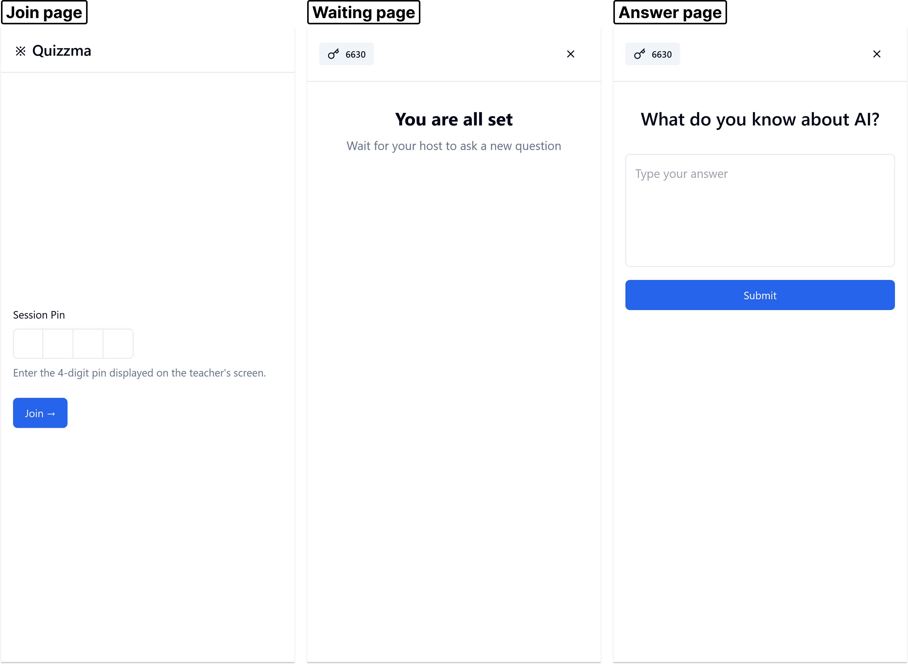

# Frontend

The Quizzma frontend runs in a browser and includes both the host/teacher's view and the audience/students' view.

Use the links to jump to the different sections:

> - [Project management](#frontend-management)
> - [Setup and run](#frontend-setup)
> - [Structure](#frontend-structure)
> - [User interface and functionality](#frontend-ui)

<a id="frontend-management"></a>

## 📦 Project management

The frontend is written in `React`+`Typescript` and bootstrapped with [Vite](https://vitejs.dev/). `Bun` is recommended for package management and running tasks. See https://bun.sh for installation. [shadcn/ui](https://ui.shadcn.com/docs/components/) is used for UI components and [Tailwindcss](https://v3.tailwindcss.com) for styling. For handling API calls and caching, [Tanstack Query](https://tanstack.com/query/v3) is used, and [Zod](https://zod.dev/) is used for form validation.

#### ✅ Quality assurance

- `Prettier` is used for formatting. Run formatting with `bun prettier` or simply check the formatting with `prettier:check`.
- `Eslint` is used for checking code quality. Run with `bun lint`.

#### 🧬 Api Service

The API service can be automatically generated from OpenAPI. Ensure the backend is running locally at http://localhost:8000 and run the following command:

```bash
bun run api:generate
```

The generated service will be located in `src/apiService`. You can now use the service to make requests to the backend through the exported api const in `/src/api.ts`.

<a id="frontend-setup"></a>

## 🏗️ Setup and run

1. Make sure to set up Firebase config as described in [./src/api/README.md](./src/api/README.md)

2. To set up required secrets and environment variables, copy `.env.example`, name the copy `.env`, and set the variables according to the descriptions in the file.

3. Ensure [Bun](https://bun.sh) is intalled and run:

```bash
# Navigate to this directory
cd frontend
# Install dependencies stated in package.json
bun i
# Run development server with hot-reload
bun dev
# Build frontend for production
bun build
```

<a id="frontend-structure"></a>

## 🗃️ Structure

The frontend is structured as an ordinary React project. The root folder contains various configuration files and the app's entrypoint HTML file `index.html`. The rest is found in the [./src](./src/) folder.

> - `api` - Setup for the Firebase client used for login and authentication.
> - `apiService` - Auto-generated type-safe API client to communicate with the Quizzma backend.
> - `components` - Reusable custom and `shadcn/ui` components.
> - `contexts` - Global React contexts, like the authorisation context.
> - `hooks` - Common React hooks like data-fetching and toasts (alerts).
> - `lib` - Helper functions for external libraries, like `shadcn/ui`.
> - `pages` - The various pages that used by hosts/teachers and audience/students. The pages builds upon the components
> - `utils` - Custom helper functions.
> - `App.tsx` - The global configuration and router of the React application, in addition to setup for `Tanstack query` and `Posthog`.
> - `main.tsx` - Main root of the React application connected to the `index.html` root.

<a id="frontend-ui"></a>

## 🗺️ User interface and functionality

The following walks through the main screens of Quizzma illustrated with screenshots. First the screens meant for [host/teacher](#ui-host), then those for the [audience/students](#ui-audience).

<a id="ui-host"></a>

### 🧑‍🏫 Host/teacher

To use Quizzma as a host/teacher, it is necessary to go to https://quizzma.no to register a user and log in. After logging in, the `Quizzes page` is shown:


This gives an overview of all created quizzes, if any exist. It also allows for creating a new quiz, in which case a popup is rendered for entering a quiz name and description:


After creating a quiz and pressing it, the `Edit quiz page` is shown for that quiz:


Here, it is possible to add pre-defined questions to be asked during a quiz session. The `More actions` dropdown also provides four options:

> - `See answers` - Goes to a page showing the responses and analyses for each question. This uses the same layout as the `Analysis page` during quiz sessions. Disabled if no questions are asked yet.
> - `Import answers` - Renders a popup for uploading `.csv` or `.txt` files with questions and related open-text responses. A language model will attempt to extract the questions and responses first. Then, responses are stored and analysed.
> - `Download answers` - Downloads a simple `.csv` file containing the questions, responses and analyses of the quiz. Each row represents a response with related question, summary, sentiments, and topics. Disabled if no questions are asked yet.
> - `Delete quiz` - Deletes the quiz and related data.

The blue `Start` button starts a quiz session for the quiz, generating a new 4-digit pin and QR code. This leads to the `Join page` to be shown on a projector/big screen to the audience:


During the session, the QR code, pin and number of connected participants are always shown in the top left. The `End quiz` button can at any time be used to end the quiz, disconnecting all participants. A popup is rendered to avoid ending unintentionally. The `Start session` button leads to the `Create question page`:


The host can type the question into the bottom input field, or click one of the pre-defined questions at the top to copy them into the field. The answering time defaults to 2 minutes, but more options are available in the dropdown. The question is published to the participants on pressing the `Publish` button, leading to the `Await answers` page:


This shows the published questions and the timer at the top. The timer can be paused or resumed through the pause/play button. The current response count is updated every 1.5 seconds, and the responses can be shown or hidden through the switch with the eye icon. Hidden by default. When the timer reaches zero or the `Move on` button is pressed, the `Analysis page` is shown:


No more responses can be submitted. An overall summary summarises the responses to the question in 1-3 bullet points. The aggregate sentiment is shown as the percentage of positive, neutral, and negative responses. The raw responses are shown in a grid, each annotated with its sentiment. Topics can be seen by flicking the `View as groups` switch in the top right:


This shows the generated topics. Selecting a topic renders a topic-specific summary, topic-specific aggregate sentiment overview, and the raw responses clustered under the topic. Each topic is annotated with the most prominent sentiment. In case of few responses, all responses may be labelled as noise, and noise is always clustered under the `Outlier Answers` topic.

The `Ask New Question` button leads back to the `Create question page`, allowing for the cycle to repeat.

<a id="ui-audience"></a>

### 🧑‍🎓 Audience/students

The audience/students can scan the QR code or go to https://quizzma.no/join and enter the pin to participate in an active quiz session anonymously. They can use a browser on their computer or phone. They have the three main screens below available:

> - `Join page` - The page at https://quizzma.no/join, where they enter a 4-digit pin to join an active quiz session.
> - `Waiting page` - Page shown after joining and when they wait for the host to publish a new question.
> - `Answer page` - Allows audience to enter one or more open-text responses after host has published a question and the timer is still active.

The session pin is visible in the top left. Pressing `x` in the top right renders a popup for leaving the session.


